

  

  
  
  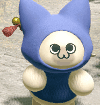
  
  

<h1 align="center">🌌 Zzzsy01 · NEON TECHNOLOGY UNIVERSE</h1>

  <strong>FROM ELECTRONS TO AGENTS · FROM EDGE TO CLOUD</strong> 
  让真实硬件、智能体、机器人与软件系统在同一张工程地图上汇合。

  🚁 UAV / Robotics &nbsp;·&nbsp; ⚙️ Embedded Systems &nbsp;·&nbsp; 🤖 AI Agents 
  ⚡ Power Electronics &nbsp;·&nbsp; 👁️ Vision AI &nbsp;·&nbsp; ☁️ Cloud Native &nbsp;·&nbsp; 🎨 Full Stack

  
  
  

---

## 🛰️ SYSTEM IDENTITY · 关于我

我目前把主要精力放在**空中具身智能无人机**项目上，关注从传感器输入、定位到规划器输出的真机链路是否可靠。

- 🧩 公开代码以 `C++` 为主，也使用 `C`、`Python`、`CMake` 与 `Shell`
- 🔍 喜欢把复杂系统拆成可以观察、验证和复现的小步骤
- 🧪 重视日志、测试清单、安全边界和真实硬件反馈
- 🧠 正在把技术版图向 Agent、ROS 2、电力电子、边缘 AI、云原生与全栈扩展

> **事实边界：** `NOW / CURRENT` 是公开仓库可验证的当前工作；`VISION / ROADMAP` 是未来准备解锁的方向，不代表已经完成或参与参考仓库。

 

## 🧬 CURRENT CORE · 当前技术核心

  
  
  
  
  
  

## 🚀 CURRENT MISSION · 当前主线

### 🚁 [SUPER_DRONE_TEAM](https://github.com/Zzzsy01/SUPER_DRONE_TEAM)

面向空中具身智能无人机的队友协作仓库，基于 `HKU-MARS/SUPER` 整理，当前聚焦**真机链路测试准备**。

- 🛰️ 检查 Jetson Orin NX 环境与基础依赖
- 🌐 观察 Livox Mid-360S 点云是否稳定
- 🧭 梳理定位 / odom 到规划器的输入链路
- 📡 验证 ROS topic、规划器输出与 RViz / 日志反馈

[**进入项目 →**](https://github.com/Zzzsy01/SUPER_DRONE_TEAM) · [中文协作入口 →](https://github.com/Zzzsy01/SUPER_DRONE_TEAM/blob/main/README_TEAM_CN.md)

---

## 🪐 TECHNOLOGY ORBIT · 技术宇宙

  

### ✨ VISION STACK · 未来想解锁的技术栈

  
  
  
  
  
  

  
  
  
  
  
  

  
  
  
  
  
  
  

  
  
  
  
  
  
  

  
  
  
  
  

---

## 🗺️ FUTURE QUEST BOARD · 未来项目地图

> 🟣 **VISION / ROADMAP**：这里是准备挑战的项目宇宙与热门开源参考。名字和目标是愿景，不代表已经完成、参与或拥有参考仓库。

### 01 · 🧠 Nebula Agent OS — 多智能体工程系统

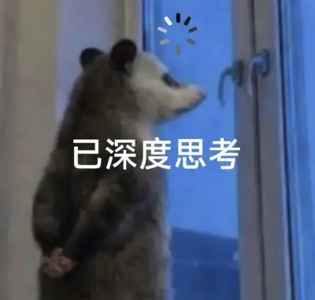

**愿景：** 打造带工具调用、长期记忆、handoff、sandbox、可观测链路与自动 eval 的 Agent 开发工作台，让智能体从“会聊天”进化为“能稳定交付任务”。 
**开源坐标：** [`OpenAI Agents SDK`](https://github.com/openai/openai-agents-python) · [`AutoGen`](https://github.com/microsoft/autogen) · [`LangGraph`](https://github.com/langchain-ai/langgraph)

 

### 02 · 🦾 Astra Autonomy Stack — ROS 2 自主系统

**愿景：** 串起感知、定位、Nav2、MoveIt 2、任务规划、仿真回放与真机部署，构建可复现的移动机器人 / 无人系统工程栈。 
**开源坐标：** [`ROS 2`](https://github.com/ros2/ros2) · [`Navigation2`](https://github.com/ros-navigation/navigation2) · [`MoveIt 2`](https://github.com/moveit/moveit2)

 

### 03 · ⚡ VoltLab Digital Twin — 电力电子数字孪生

**愿景：** 围绕 DC-DC、逆变器、磁性元件与控制环路，把参数扫描、模型验证、实时数据和故障诊断装进一个可视化实验平台。 
**开源坐标：** [`Open Source Power Electronics`](https://github.com/upb-lea/awesome-open-source-power-electronics) · [`MAGNet`](https://github.com/PrincetonUniversity/magnet) · [`Microgrid Gym`](https://github.com/upb-lea/openmodelica-microgrid-gym)

 

### 04 · 🧠 EdgeForge AI — 嵌入式边缘智能

**愿景：** 在 MCU、ESP32 与边缘设备上打通 RTOS、传感器、模型量化、端侧推理和 OTA，让 AI 真正离开云端进入设备。 
**开源坐标：** [`Zephyr`](https://github.com/zephyrproject-rtos/zephyr) · [`ESP-IDF`](https://github.com/espressif/esp-idf) · [`ExecuTorch`](https://github.com/pytorch/executorch)

 

### 05 · 👁️ Vision Fusion Lab — 视觉与多模态感知

**愿景：** 探索目标检测、分割、跟踪、视觉语言模型与多传感器融合，为机器人构建可解释、可评测的环境感知层。 
**开源坐标：** [`OpenCV`](https://github.com/opencv/opencv) · [`Transformers`](https://github.com/huggingface/transformers) · [`Ultralytics`](https://github.com/ultralytics/ultralytics)

 

### 06 · ☁️ Titan Service Mesh — 云原生全栈后端

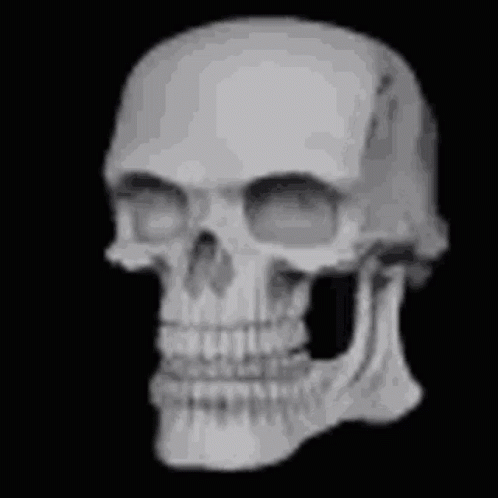

**愿景：** 用 Java / Spring Boot、FastAPI 与 NestJS 组合设备管理、认证、实时消息、异步任务、数据库与事件流，再交给容器平台弹性运行。 
**开源坐标：** [`Spring Boot`](https://github.com/spring-projects/spring-boot) · [`FastAPI`](https://github.com/fastapi/fastapi) · [`NestJS`](https://github.com/nestjs/nest) · [`Kubernetes`](https://github.com/kubernetes/kubernetes)

 

### 07 · 🎨 HoloControl UI — 3D 工业控制台

**愿景：** 把实时遥测、轨迹、告警、三维场景与交互式图表做成兼顾桌面与移动端的未来感控制界面。 
**开源坐标：** [`React`](https://github.com/react/react) · [`Vue`](https://github.com/vuejs/core) · [`Three.js`](https://github.com/mrdoob/three.js) · [`Apache ECharts`](https://github.com/apache/echarts)

 

### 08 · 🦀 Rusty Command Deck — 高性能桌面工具

**愿景：** 用 Rust、Tokio 与 Tauri 打造轻量、安全、跨平台的设备调试台、日志分析器和工程效率工具。 
**开源坐标：** [`Rust`](https://github.com/rust-lang/rust) · [`Tokio`](https://github.com/tokio-rs/tokio) · [`Tauri`](https://github.com/tauri-apps/tauri)

 

### 09 · 📈 Telemetry Cloud — 全链路可观测平台

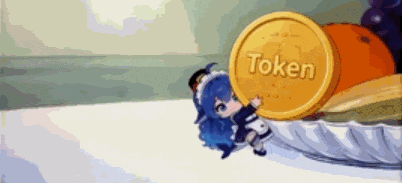

**愿景：** 统一采集机器人、边缘设备和云服务的 metrics、logs 与 traces，构建从异常发现到根因定位的工程闭环。 
**开源坐标：** [`OpenTelemetry Collector`](https://github.com/open-telemetry/opentelemetry-collector) · [`Prometheus`](https://github.com/prometheus/prometheus) · [`Grafana`](https://github.com/grafana/grafana)

 

---

## 🎮 DEBUG ENERGY · 调试能量条

  
  
  
  
  
  

  
  
  
  
  
  
  

  
  
  
  
  

<strong>启动：</strong>😎 → <strong>报错：</strong>💀 → <strong>深度思考：</strong>🧠 → <strong>链路跑通：</strong>🚀

  
<strong>🧰 MEME / STICKER VAULT · 展开全部素材（28 个新增候选 + 2 个视觉重复素材）</strong>

   
  

    
    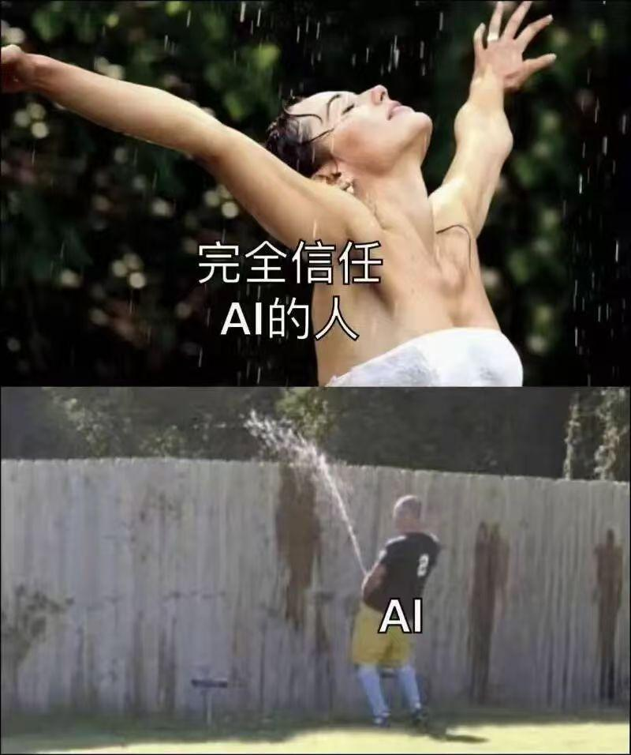
    
    
    
    
  

  

    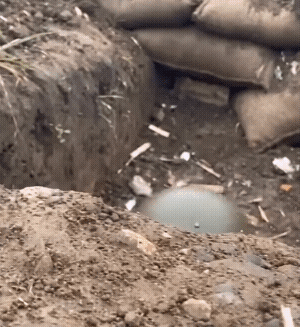
    
    
    
    
    
  

  

    
    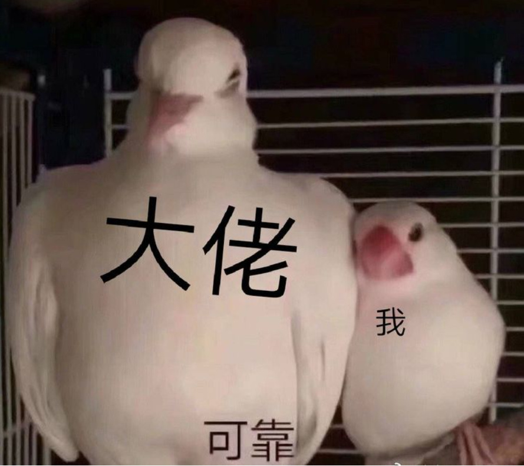
    
    
    
    
  

  

    
    
    
    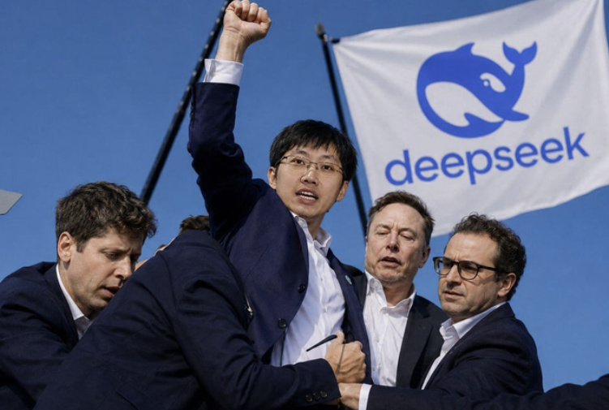
    
    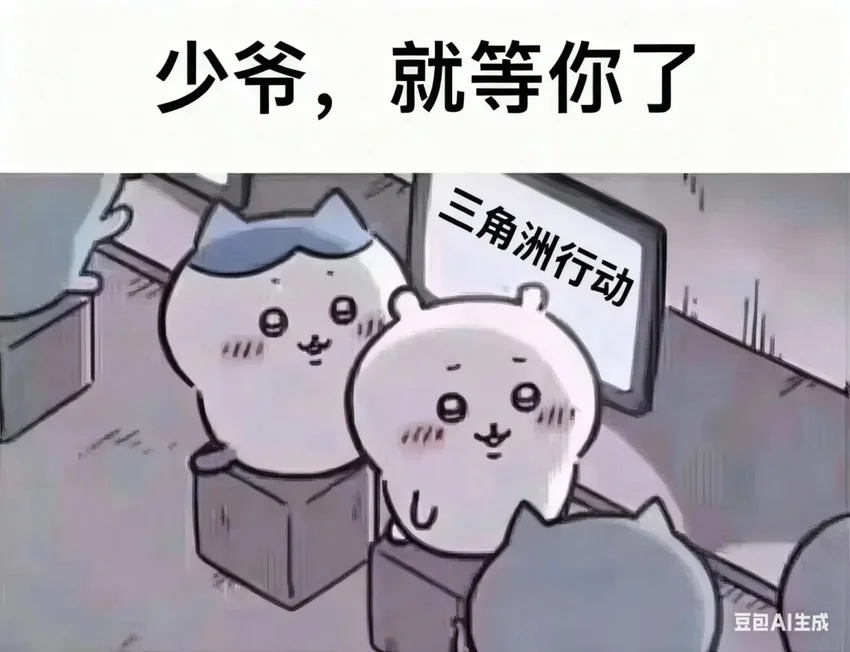
  

  

    
    
    
    
    
    
  

---

## 📡 CONNECT · 联系我

  
  

  
<strong>🎨 OPEN-SOURCE DESIGN DNA · 设计灵感与透明说明</strong>

   
  
视觉结构参考了开源 Profile README 画廊，以及 shadcn/ui、Ant Design、Tabler Icons、Three.js 等项目常见的 aurora、bento、pill、dashboard 设计语言；本页的霓虹 SVG、文案和结构均为重新设计。

  <ul>
    <li><a href="https://github.com/kautukkundan/Awesome-Profile-README-templates">Awesome Profile README templates</a></li>
    <li><a href="https://github.com/roypriyanshu02/awesome-github-profile-readme">Awesome GitHub Profile README gallery</a></li>
    <li><a href="https://github.com/navi3582/animated-github-profile">Animated GitHub Profile</a></li>
    <li><a href="https://github.com/shadcn-ui/ui">shadcn/ui</a> · <a href="https://github.com/ant-design/ant-design">Ant Design</a> · <a href="https://github.com/tabler/tabler-icons">Tabler Icons</a></li>
  </ul>
  
热门仓库只作为学习坐标，没有把他人的项目、贡献、经历或成果写成自己的。

---

   
  <strong>✨ BUILD THE IMPOSSIBLE · VERIFY THE REAL ✨</strong> 
  今天多跑通一条链路，明天多解锁一个技术宇宙。

