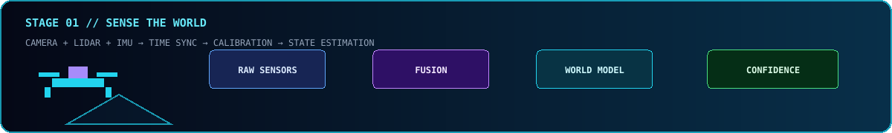
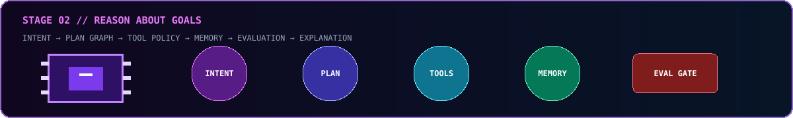
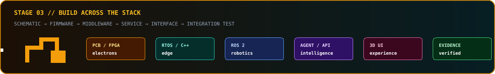
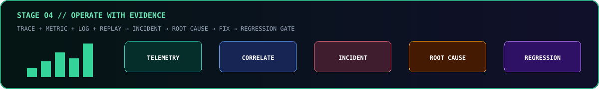

  

  
  
  
  
  

<h1 align="center">⚡ Zzzsy01 // CYBERNETIC SYSTEMS LAB</h1>

  <strong>FROM ELECTRONS TO INTELLIGENCE · FROM EDGE TO AUTONOMY</strong> 
  真实硬件 × 机器人 × 智能体 × 电力电子 × 云原生 × 未来交互

  
  
  
  

> [!IMPORTANT]
> `CURRENT / NOW` 是公开仓库可以验证的当前工作；`VISION / ROADMAP` 是未来系统设计，不代表已经完成、参与或拥有所引用的开源项目。

---

## 🌐 POLYGLOT MISSION · 多语言技术宣言

  
  
  
  

🇨🇳 **中文** — 构建能够感知世界、理解目标、安全行动、持续学习并解释决策的可验证智能系统。

🇺🇸 **English** — Build verifiable intelligent systems that perceive the world, understand goals, act safely, learn continuously, and explain their decisions.

🇯🇵 **日本語** — 世界を認識し、目標を理解し、安全に行動し、継続的に学習し、判断を説明できる検証可能な知能システムを構築する。

🇰🇷 **한국어** — 세상을 인식하고, 목표를 이해하며, 안전하게 행동하고, 지속적으로 학습하며, 결정을 설명할 수 있는 검증 가능한 지능형 시스템을 구축합니다.

🇩🇪 **Deutsch** — Verifizierbare intelligente Systeme bauen, die ihre Umwelt wahrnehmen, Ziele verstehen, sicher handeln, kontinuierlich lernen und Entscheidungen erklären.

🇫🇷 **Français** — Construire des systèmes intelligents vérifiables capables de percevoir le monde, de comprendre les objectifs, d’agir en sécurité, d’apprendre en continu et d’expliquer leurs décisions.

---

## 🛰️ CURRENT IDENTITY · 当前真实主线

我目前把主要精力放在**空中具身智能无人机**项目上，关注从传感器输入、定位到规划器输出的真机链路是否可靠。

- `C++` 是公开代码的主要语言；同时使用 `C`、`Python`、`CMake`、`Shell` 与 Linux 工具链。
- 关注真实传感器、时间同步、坐标系、定位 / odom、规划器输入输出与安全边界。
- 倾向把复杂系统拆成可观察、可复现、可回放、可验证的工程步骤。
- 当前主页只把公开可核验内容写进 `CURRENT`；其它宏大方向统一进入 `VISION`。

### 🚁 [SUPER_DRONE_TEAM](https://github.com/Zzzsy01/SUPER_DRONE_TEAM)

面向空中具身智能无人机的协作仓库，基于 `HKU-MARS/SUPER` 整理，当前聚焦真机链路测试准备：

- 检查 Jetson Orin NX 环境、基础依赖与可复现启动路径。
- 观察 Livox Mid-360S 点云输入是否连续、时间戳是否合理。
- 梳理定位 / odom 到规划器的输入链路及关键 ROS topic。
- 验证规划器输出、RViz 可视化和日志反馈能否共同构成判断证据。
- 在受控环境中逐步推进，不把仿真可运行直接等同于真机安全。

[**进入项目 →**](https://github.com/Zzzsy01/SUPER_DRONE_TEAM) · [**中文协作入口 →**](https://github.com/Zzzsy01/SUPER_DRONE_TEAM/blob/main/README_TEAM_CN.md)

  
  

### CURRENT CORE / 当前核心工具

  
  
  
  
  
  

---

## 🧠 SYSTEM UNIVERSE · 专业系统架构

  

这张架构图不是“已经全部掌握”的技能墙，而是一套未来工程系统的目标形态：物理世界从电力电子、传感器、嵌入式计算和机器人平台进入感知 / 状态 / 规划核心；数字世界提供 Agent、服务网格、数据流、交互和安全保障；整个系统必须穿过仿真、SIL、HIL、台架、受控实地与真实任务六道验证门。

### VISION STACK / 未来技术矩阵

**Robotics & Simulation**

  
  
  
  
  
  

**Embedded, Hardware & Power**

  
  
  
  
  
  

**AI, Agents & Perception**

  
  
  
  
  
  
  
  

**Backend, Data & Cloud**

  
  
  
  
  
  
  
  
  
  
  

**Interface, Reliability & Security**

  
  
  
  
  
  
  
  
  
  
  

## 🛰️ ROADMAP A · EMBODIED INTELLIGENCE / 具身智能

### 01 · Astra Autonomy Stack — ROS 2 自主系统平台

**System thesis / 系统命题：** 建立一套可以从仿真重复执行到真实机器人受控部署的自主系统基线，把感知、状态估计、导航、任务规划、控制和安全监督变成明确接口，而不是依赖一次性 launch 文件拼接。

- **Architecture：** ROS 2 lifecycle nodes、DDS QoS、TF tree、行为树、Nav2、MoveIt 2、任务状态机与安全 supervisor。
- **Research questions：** 如何处理传感器延迟、坐标系漂移、局部规划振荡、执行超时与失联降级？
- **Work packages：** 仿真场景、接口契约、bag 回放、故障注入、HIL、遥测面板、任务回归集。
- **MVP：** 在仿真中稳定完成定位、路径规划、避障和任务恢复，并能通过同一套检查清单迁移到受控真机。
- **Evidence：** 成功率、规划耗时、轨迹误差、恢复次数、最小安全距离、消息丢失率和可重复运行脚本。
- **Beyond MVP：** 多机器人协同、语义任务规划、地图版本管理、在线风险评估和 human-in-the-loop 接管。
- **Open-source anchors：** [`ROS 2`](https://github.com/ros2/ros2) · [`Navigation2`](https://github.com/ros-navigation/navigation2) · [`MoveIt 2`](https://github.com/moveit/moveit2) · [`Isaac ROS Common`](https://github.com/NVIDIA-ISAAC-ROS/isaac_ros_common)

### 02 · Vision Fusion Engine — 多模态感知与世界模型

**System thesis / 系统命题：** 把相机、LiDAR、IMU、里程计和语言语义统一进带时间、坐标系与置信度的世界模型，让规划器消费“可解释状态”而不是互相矛盾的原始检测结果。

- **Architecture：** calibration registry、time synchronizer、detector / segmenter、tracker、fusion graph、scene memory 与 uncertainty API。
- **Research questions：** 跨模态时间对齐怎样影响跟踪？模型置信度怎样传播到规划安全边界？遮挡和传感器失效怎样显式暴露？
- **Work packages：** 数据录制、标注规范、离线评测、ONNX 导出、端侧基准、融合消融、错误案例库。
- **MVP：** 对选定对象完成检测、跟踪、空间定位与可回放评测，并输出统一坐标系下的置信度状态。
- **Evidence：** precision / recall、ID switch、端到端延迟、显存占用、功耗、距离误差和坏天气退化曲线。
- **Beyond MVP：** 视觉语言模型、开放词汇检测、3D occupancy、主动感知与基于不确定性的下一视角规划。
- **Open-source anchors：** [`OpenCV`](https://github.com/opencv/opencv) · [`Transformers`](https://github.com/huggingface/transformers) · [`Ultralytics`](https://github.com/ultralytics/ultralytics) · [`ONNX Runtime`](https://github.com/microsoft/onnxruntime)

### 03 · Synthetic World Factory — 仿真、合成数据与数字试验场

**System thesis / 系统命题：** 把仿真从“能看到机器人动”升级为可版本化的试验基础设施，为算法提供场景、随机化、真值、故障和回归测试，而不是把真机变成第一测试环境。

- **Architecture：** scene packages、asset registry、physics profiles、sensor models、scenario DSL、seed manager 和 result collector。
- **Research questions：** 哪些模拟误差会破坏 sim-to-real？怎样给场景难度分级？怎样复现偶发碰撞或定位失败？
- **Work packages：** Gazebo / Webots 场景、CARLA 研究、domain randomization、故障脚本、合成标注、批量运行器。
- **MVP：** 形成可一键运行的基础场景集，固定随机种子后能复现结果，并输出统一报告。
- **Evidence：** 场景覆盖率、仿真速度、随机种子可复现性、真值完整度、仿真与实测关键指标差异。
- **Beyond MVP：** 大规模并行仿真、生成式场景、稀有事件挖掘、自动 curriculum 与 sim-to-real 校准。
- **Open-source anchors：** [`Gazebo Sim`](https://github.com/gazebosim/gz-sim) · [`Webots`](https://github.com/cyberbotics/webots) · [`CARLA`](https://github.com/carla-simulator/carla)

### 04 · Human–Robot Collaboration Kernel — 人机协同内核

**System thesis / 系统命题：** 为操作者、Agent 和机器人建立清晰的权限、意图、解释、确认与接管协议，使系统既能自动执行，也能在不确定或高风险时主动请求人类判断。

- **Architecture：** intent gateway、role / capability model、approval gate、explanation packet、teleoperation bridge 与 emergency stop。
- **Research questions：** 哪些动作必须确认？怎样用最少信息解释风险？接管后如何保持状态一致？
- **Work packages：** 权限矩阵、命令语法、确认 UI、语音 / 文本入口、审计日志、误操作测试和可访问性检查。
- **MVP：** 用户能查看系统意图、批准或拒绝高风险动作、随时接管，并能追踪每次决定的来源。
- **Evidence：** 人类响应时间、误确认率、接管成功率、任务恢复时间、解释理解度与审计完整性。
- **Beyond MVP：** 多操作者协作、AR 指引、自然语言任务分解、技能教学和个性化交互策略。
- **Open-source anchors：** [`ROS 2`](https://github.com/ros2/ros2) · [`OpenAI Agents SDK`](https://github.com/openai/openai-agents-python) · [`React`](https://github.com/facebook/react)

## 🧠 ROADMAP B · AGENTIC INTELLIGENCE / 智能体工程

### 05 · Nebula Agent OS — 多智能体任务操作系统

**System thesis / 系统命题：** 将工具调用、上下文、记忆、handoff、预算、安全策略和评测统一为可检查的 Agent runtime，让“会对话”变成“能在边界内稳定完成任务”。

- **Architecture：** planner、typed tool registry、state graph、memory tiers、handoff bus、policy engine、sandbox 与 event log。
- **Research questions：** 什么时候应交接给另一个 Agent？记忆如何过期？工具失败后如何恢复？怎样防止计划无限扩张？
- **Work packages：** tool schema、session store、可重放事件、guardrails、mock environment、golden tasks、cost / latency budget。
- **MVP：** 完成一个端到端工程任务：检索上下文、调用工具、生成变更、执行验证、失败回滚并输出证据包。
- **Evidence：** task success、tool error recovery、handoff correctness、token / time cost、重复运行一致性与人工接管次数。
- **Beyond MVP：** 层级 Agent 团队、长期项目记忆、环境沙箱、模型路由、自动任务拆分与自适应评测。
- **Open-source anchors：** [`OpenAI Agents SDK`](https://github.com/openai/openai-agents-python) · [`AutoGen`](https://github.com/microsoft/autogen) · [`LangGraph`](https://github.com/langchain-ai/langgraph)

### 06 · Agent Evaluation Foundry — 智能体评测与可观测工厂

**System thesis / 系统命题：** 为 Agent 建立类似软件测试与 SRE 的质量体系，把 prompt、模型、工具、记忆和环境变化对结果的影响变成可比较数据。

- **Architecture：** trace collector、dataset registry、grader fleet、experiment runner、error taxonomy、regression gate 与 review UI。
- **Research questions：** 怎样评测长链任务？自动 grader 如何校准？怎样区分模型失败、工具失败和环境失败？
- **Work packages：** 离线任务集、仿真工具、人工标注协议、pairwise comparison、红队样本、版本报告。
- **MVP：** 每次 Agent 变更都能在固定任务集上跑出成功率、成本、时延、错误类型和可回放 trace。
- **Evidence：** grader agreement、regression escape rate、failure localization time、coverage、成本与质量 Pareto 曲线。
- **Beyond MVP：** 在线监控、主动采样、对抗评测、漂移检测、自动 root-cause 建议和 policy compliance。
- **Open-source anchors：** [`Langfuse`](https://github.com/langfuse/langfuse) · [`Phoenix`](https://github.com/Arize-ai/phoenix) · [`OpenTelemetry`](https://github.com/open-telemetry/opentelemetry-collector)

### 07 · Multimodal Knowledge Fabric — 多模态知识织网

**System thesis / 系统命题：** 将代码、Markdown、日志、图片、CAD、传感器数据和实验记录组织为带来源、时间、权限与置信度的知识层，为人和 Agent 提供同一份可追溯事实源。

- **Architecture：** ingestion pipeline、schema registry、document graph、vector index、artifact store、provenance ledger 与 retrieval policy。
- **Research questions：** 结构化与语义检索如何协同？过时知识怎样失效？推断如何与事实分开？
- **Work packages：** 文档解析、元数据、实体链接、版本追踪、引用生成、权限过滤、质量检查和知识蒸馏。
- **MVP：** 对一个工程项目实现从问题到来源引用的检索，并能区分当前状态、历史 Session、决策与原始证据。
- **Evidence：** retrieval recall、citation precision、staleness rate、重复率、人工核验时间和错误来源定位率。
- **Beyond MVP：** 多模态 RAG、项目数字线程、自动知识维护、决策影响图和跨项目经验复用。
- **Open-source anchors：** [`Transformers`](https://github.com/huggingface/transformers) · [`LangGraph`](https://github.com/langchain-ai/langgraph) · [`DuckDB`](https://github.com/duckdb/duckdb)

### 08 · EdgeForge AI — 端侧智能计算平台

**System thesis / 系统命题：** 在 MCU、ESP32、Jetson 与其他边缘设备上建立从模型选择、量化、部署到遥测的完整路径，让 AI 在网络受限、功耗受限和实时约束下可靠运行。

- **Architecture：** RTOS / Linux abstraction、sensor driver、model package、inference runtime、accelerator backend、OTA 与 health telemetry。
- **Research questions：** 精度、延迟、内存和功耗如何平衡？设备异构性怎样隔离？模型更新如何安全回滚？
- **Work packages：** Zephyr / ESP-IDF demo、ONNX / ExecuTorch 导出、量化、benchmark harness、thermal test、OTA manifest。
- **MVP：** 在至少一类边缘设备上完成真实传感器输入、端侧推理、结果发布和性能报告。
- **Evidence：** p50 / p95 latency、RAM / flash、功耗、温升、模型精度、启动时间与更新成功率。
- **Beyond MVP：** 多模型调度、异构加速、联邦学习、隐私计算、自动设备画像与边云协同。
- **Open-source anchors：** [`Zephyr`](https://github.com/zephyrproject-rtos/zephyr) · [`ESP-IDF`](https://github.com/espressif/esp-idf) · [`ExecuTorch`](https://github.com/pytorch/executorch) · [`ONNX Runtime`](https://github.com/microsoft/onnxruntime)

## ⚙️ ROADMAP C · HARDWARE × PLATFORM / 硬件与平台

### 09 · VoltLab Digital Twin — 电力电子数字孪生实验室

**System thesis / 系统命题：** 将 DC-DC、逆变器、磁性元件、控制环路、热模型和真实测量连接成可校准的数字孪生，用模型指导实验，也用实验反向修正模型。

- **Architecture：** component library、parameter database、solver adapter、controller model、DAQ bridge、calibration engine 与 experiment dashboard。
- **Research questions：** 元件容差和温度怎样传播到系统稳定性？仿真模型在哪些工作区间失真？控制器如何安全更新？
- **Work packages：** 拓扑模型、磁性元件参数化、控制环路、Monte Carlo、Bode / transient 分析、实验采集和模型校准。
- **MVP：** 对一个选定功率级建立可运行模型，完成参数扫描，并用一组实验波形校准关键参数。
- **Evidence：** 稳态误差、瞬态误差、效率、纹波、温升、相位裕度、模型计算时间和实验重复性。
- **Beyond MVP：** 实时数字孪生、故障诊断、寿命预测、自动控制器整定、多物理场优化与硬件在环。
- **Open-source anchors：** [`Open Source Power Electronics`](https://github.com/upb-lea/awesome-open-source-power-electronics) · [`MAGNet`](https://github.com/PrincetonUniversity/magnet) · [`OpenModelica Microgrid Gym`](https://github.com/upb-lea/openmodelica-microgrid-gym)

### 10 · Silicon-to-System Lab — FPGA、RISC-V 与开放硬件

**System thesis / 系统命题：** 打通从电路原理图、PCB、FPGA gateware、RISC-V SoC 到固件和上层接口的完整链路，理解软件抽象最终怎样落到时序、电气与物理约束。

- **Architecture：** KiCad design、FPGA fabric、LiteX SoC、RISC-V firmware、DMA / bus、logic analyzer 和 host API。
- **Research questions：** 延迟和吞吐怎样在硬件 / 软件之间分配？接口时序如何验证？怎样构建可升级而不失控的硬件平台？
- **Work packages：** 原理图、PCB rule、简单外设、FPGA pipeline、软核 SoC、boot flow、driver、CI simulation 与台架测试。
- **MVP：** 自建一个小型采集或控制板，完成从信号输入到主机可视化的闭环，并保存设计与测试证据。
- **Evidence：** timing closure、信号完整性、吞吐、延迟、功耗、启动可靠性、错误注入结果和 BOM 可追溯性。
- **Beyond MVP：** 自定义加速器、实时 Ethernet、motor control、partial reconfiguration、形式验证和开放硬件发布。
- **Open-source anchors：** [`RISC-V ISA Manual`](https://github.com/riscv/riscv-isa-manual) · [`LiteX`](https://github.com/enjoy-digital/litex) · [`KiCad source mirror`](https://github.com/KiCad/kicad-source-mirror)

### 11 · Titan Control Plane — 机器人云原生控制平面

**System thesis / 系统命题：** 为设备、机器人、任务、用户、配置和软件版本建立统一控制平面，把现场节点从“单机手工维护”升级为可管理、可升级、可审计的 fleet。

- **Architecture：** Spring Boot domain services、FastAPI AI gateway、NestJS realtime gateway、PostgreSQL、Redis、object storage、Kubernetes 与 GitOps。
- **Research questions：** 云端命令怎样避免越权或重复执行？离线设备如何同步？配置与软件版本怎样安全回滚？
- **Work packages：** identity、RBAC、device registry、job scheduler、WebSocket、artifact delivery、audit、API contract 与 deployment manifests。
- **MVP：** 注册设备、下发受控任务、观察状态、记录审计日志，并能在失败后安全重试或取消。
- **Evidence：** API SLO、command delivery rate、idempotency、offline recovery、deployment rollback time 和权限测试覆盖。
- **Beyond MVP：** 多租户、跨区域 fleet、策略即代码、资源调度、边云协同与设备生命周期自动化。
- **Open-source anchors：** [`Spring Boot`](https://github.com/spring-projects/spring-boot) · [`FastAPI`](https://github.com/fastapi/fastapi) · [`NestJS`](https://github.com/nestjs/nest) · [`Kubernetes`](https://github.com/kubernetes/kubernetes) · [`Argo CD`](https://github.com/argoproj/argo-cd)

### 12 · Digital Thread Data Mesh — 工业数据流与数字线程

**System thesis / 系统命题：** 为需求、设计、固件、设备、任务、遥测、实验和故障建立贯穿生命周期的事件流，让每个结果都能追溯到配置、代码、模型和物理对象。

- **Architecture：** event schema、Kafka backbone、Flink processing、DuckDB analytics、digital twin registry、lakehouse files 和 lineage graph。
- **Research questions：** 事件 schema 怎样演进？迟到和乱序数据怎样处理？数字孪生如何与真实设备保持一致？
- **Work packages：** topic taxonomy、schema registry、CDC、stream joins、time window、quality rules、twin sync 和 analytical notebook。
- **MVP：** 将一条设备遥测链路实时接入、清洗、聚合、告警、查询，并关联到设备与软件版本。
- **Evidence：** end-to-end lag、吞吐、重复 / 丢失事件、schema compatibility、数据质量、查询成本与 lineage 完整度。
- **Beyond MVP：** 实时特征、异常检测、预测维护、跨项目知识图谱、自动报告与闭环优化。
- **Open-source anchors：** [`Apache Kafka`](https://github.com/apache/kafka) · [`Apache Flink`](https://github.com/apache/flink) · [`DuckDB`](https://github.com/duckdb/duckdb) · [`ThingsBoard`](https://github.com/thingsboard/thingsboard) · [`Eclipse Ditto`](https://github.com/eclipse-ditto/ditto)

## 🛡️ ROADMAP D · OPERATIONS × EXPERIENCE / 运行与体验

### 13 · Telemetry Reliability Cloud — 全链路可观测与 SRE

**System thesis / 系统命题：** 用统一 trace、metric、log、bag replay 和 incident timeline 连接机器人、边缘设备、Agent 与云服务，把“偶尔出错”转化为可定位、可复现、可防止复发的问题。

- **Architecture：** OpenTelemetry collector、Prometheus、Grafana、log store、trace backend、robot bag index、alert router 和 runbook portal。
- **Research questions：** 怎样跨 ROS graph 与云服务关联一次任务？资源受限设备上采样多少才够？告警怎样避免疲劳？
- **Work packages：** semantic conventions、collector pipeline、golden signals、SLO、alert rules、dashboard、incident template 与 replay tooling。
- **MVP：** 从一个失败任务跳转到相关 trace、指标、日志和传感器回放，并形成可复核 incident 记录。
- **Evidence：** MTTD、MTTR、alert precision、trace coverage、telemetry overhead、replay success 和 regression prevention rate。
- **Beyond MVP：** 异常关联、自动 root cause ranking、容量预测、SLO burn-rate、混沌工程与自愈流程。
- **Open-source anchors：** [`OpenTelemetry Collector`](https://github.com/open-telemetry/opentelemetry-collector) · [`Prometheus`](https://github.com/prometheus/prometheus) · [`Grafana`](https://github.com/grafana/grafana)

### 14 · DevSecOps Trust Mesh — 软件供应链与零信任设备

**System thesis / 系统命题：** 从源码、依赖、容器、固件、设备身份到运行时行为建立连续信任链，使每个部署物都能说明“谁构建、用什么构建、是否被扫描、谁批准、运行在哪里”。

- **Architecture：** SBOM、vulnerability scanner、signed artifact、provenance、policy gate、device identity、secret manager 与 runtime detection。
- **Research questions：** 边缘设备怎样轮换身份？离线升级如何验证签名？依赖漏洞与实际风险怎样排序？
- **Work packages：** dependency inventory、Trivy scan、Cosign signing、admission policy、secret rotation、Falco rules 和 incident drill。
- **MVP：** CI 生成 SBOM、扫描镜像、签名产物，部署端验证签名，并记录不可抵赖的发布元数据。
- **Evidence：** unsigned artifact block rate、critical vulnerability age、secret exposure count、policy coverage 和 recovery drill time。
- **Beyond MVP：** 硬件根信任、远程证明、固件透明日志、行为基线、自动隔离与合规证据包。
- **Open-source anchors：** [`Trivy`](https://github.com/aquasecurity/trivy) · [`Falco`](https://github.com/falcosecurity/falco) · [`Cosign`](https://github.com/sigstore/cosign)

### 15 · HoloControl UI — 三维工业控制台与空间界面

**System thesis / 系统命题：** 把任务、地图、轨迹、传感器、能量、告警、Agent 解释和数字孪生压缩成可操作的实时界面，在桌面和移动端都保持层级、响应与安全确认。

- **Architecture：** React / Vue shell、Three.js scene、ECharts telemetry、realtime gateway、design tokens、command palette 和 responsive layout。
- **Research questions：** 如何显示复杂系统而不淹没操作者？三维信息何时真的比二维更好？高风险动作如何防误触？
- **Work packages：** information architecture、bento panels、map / 3D viewer、timeline、alert center、accessibility、mobile mode 与 visual regression。
- **MVP：** 实时显示设备、任务、轨迹、关键指标和告警；用户能追踪状态来源并执行受控操作。
- **Evidence：** task completion time、interaction error、frame rate、data latency、mobile overflow、keyboard coverage 和 usability findings。
- **Beyond MVP：** AR spatial control、多人协作、数字孪生编辑、自然语言 command center 与可组合插件面板。
- **Open-source anchors：** [`React`](https://github.com/facebook/react) · [`Vue`](https://github.com/vuejs/core) · [`Three.js`](https://github.com/mrdoob/three.js) · [`Apache ECharts`](https://github.com/apache/echarts) · [`Magic UI`](https://github.com/magicuidesign/magicui)

### 16 · Rusty Command Deck — 高性能跨平台工程工具

**System thesis / 系统命题：** 用 Rust、Tokio 与 Tauri 构建设备调试、日志分析、固件管理、bag 检索和现场诊断工具，把性能敏感核心与熟悉的 Web UI 结合起来。

- **Architecture：** Rust core、Tokio async runtime、typed command bus、plugin API、SQLite / DuckDB、Tauri frontend 和 signed updater。
- **Research questions：** 怎样安全暴露系统权限？大日志如何流式分析？插件怎样隔离崩溃与不可信输入？
- **Work packages：** serial / network adapters、file parser、search index、command runner、desktop UI、packaging、auto update 与 crash report。
- **MVP：** 一个跨平台桌面工具可连接设备、查看日志、执行受限命令、导出诊断包，并在断连后恢复会话。
- **Evidence：** startup time、memory、throughput、UI responsiveness、crash-free rate、installer size 和 update rollback success。
- **Beyond MVP：** WASM 插件、远程协作、脚本市场、可视化 pipeline、离线 AI 助手与统一工程工作台。
- **Open-source anchors：** [`Rust`](https://github.com/rust-lang/rust) · [`Tokio`](https://github.com/tokio-rs/tokio) · [`Tauri`](https://github.com/tauri-apps/tauri)

---

## 📐 ROADMAP DELIVERY STANDARD · 未来项目交付标准

每个未来实验室都不以“仓库建好”作为完成，而采用同一套工程门禁：

1. **Problem Contract / 问题契约** — 说明用户、环境、输入、输出、危险边界、非目标和成功指标。
2. **Interface Contract / 接口契约** — 固化消息、API、数据 schema、时间语义、坐标系、错误码和版本策略。
3. **Executable Baseline / 可执行基线** — 提供最小运行路径、固定数据、确定依赖和一键验证脚本。
4. **Observability First / 可观测优先** — 在扩展功能前先建立 trace、metric、log、recording 和 replay。
5. **Progressive Validation / 渐进验证** — 仿真 → SIL → HIL → 台架 → 受控实地 → 真实任务逐级推进。
6. **Failure Engineering / 失败工程** — 记录已知失败、故障注入、恢复策略、回滚路径与安全状态。
7. **Evidence Package / 证据包** — 每个里程碑必须包含配置、版本、数据、结果、限制和可复现步骤。
8. **Operational Readiness / 运行准备** — SLO、告警、runbook、权限、安全扫描、备份和事故演练缺一不可。

### Definition of Done / 完成定义

- 能由另一台干净环境或另一位协作者复现，而不是只在开发者机器上运行。
- 能解释关键架构选择、风险与被放弃方案，而不是只留下最终代码。
- 能用数据证明改善，也能明确说明在哪些条件下尚不成立。
- 发生失败时能定位、恢复、回滚并保留证据，而不是依赖“重启试试”。
- 对真实世界或高风险动作设置人工确认、限幅、超时、急停和安全状态。

---

## 🎭 ENGINEERING MEME RUNTIME · 表情包驱动的工程状态机

这些素材不再塞进一个孤立仓库，而是分别对应真实工程流程中的心理状态、风险提示与团队暗号。

### STATE 00 · 需求澄清：先确认到底要解决什么

先识别谁是“大佬”、谁在执行、接口是否可靠、问题是否真的存在。没有问题契约就开始写代码，后续所有“努力”都可能只是高成本跑偏。

  
  
  

### STATE 01 · 架构评审：宏大叙事必须落到接口

把“陪你聊天”“全面领先”“系统很强”翻译成模块、数据流、故障边界、性能预算和验证门。专业不是堆名词，而是每个名词都能指向一个可执行工作包。

  
  
  

### STATE 02 · 原型兴奋期：第一个 demo 真的跑起来了

快速原型的价值是验证最大风险，不是制造“项目已完成”的幻觉。此时允许庆祝，但下一步必须补测试、可观测性和失败路径。

  
  
  
  

### STATE 03 · 依赖安装期：环境开始教育人类

驱动、版本、编译器、CUDA、系统库、权限和网络依赖会一起出现。解决方式不是无限试命令，而是记录环境契约、最小复现和每次变化的证据。

  
  
  
  
  

### STATE 04 · AI 输出验收：一个字都不能盲信

生成速度不等于工程正确性。所有 AI 输出都要经过来源检查、接口检查、静态检查、测试、真实运行和边界条件验证；高风险决定必须保留人类责任链。

  
  
  
  

### STATE 05 · 调试战斗：从情绪切回假设

报错时先冻结变量、收集证据、构造最小复现，再逐层排除输入、状态、时序、并发、资源和环境问题。拳头可以出现在表情包里，不能出现在诊断方法里。

  
  
  
  

### STATE 06 · 硬件上电：先限流，再勇敢

真实硬件不会因为 README 很酷就自动安全。上电前检查供电、极性、地、限流、急停、机械干涉与通信状态；第一次验证永远从最小能量开始。

  
  
  
  

### STATE 07 · 发布部署：不要把 Token 一脚踢进生产

发布必须包含版本、变更、审批、签名、配置、迁移、回滚和观察窗口。能部署只是起点，能安全撤回才算具备工程能力。

  
  
  
  

### STATE 08 · 线上事故：先恢复服务，再讨论锅

事故期间减少猜测和指责，先控制影响、建立时间线、保存现场、执行 runbook；恢复后再做无责复盘，修复系统而不是只教育当事人。

  
  
  
  

### STATE 09 · 恢复与庆祝：跑通之后留下可复现路径

真正值得庆祝的不是“这次终于好了”，而是下次任何人都能用文档、脚本、测试和证据稳定重现。然后再让两个毛绒玩偶负责庆功。

  
  

---

## 🎨 OPEN-SOURCE DESIGN DNA · 开源设计基因

这一版没有直接复制别人的身份、经历或整页文案，而是把开源项目中适合 GitHub Markdown 的视觉模式重新实现为本地 SVG：

- **Terminal / self-contained SVG：** 参考 [`animated-github-profile`](https://github.com/navi3582/animated-github-profile) 的“动画全部封装在自托管 SVG”思路，不需要 Token、服务器或统计卡服务。
- **Bento / animated beam / retro grid：** 参考 [`Magic UI`](https://github.com/magicuidesign/magicui) 的信息密度、边框光束、网格与节点连接语言，重新绘制为 README 可显示的 SVG HUD。
- **Pixel gamification：** 参考 [`Platane/snk`](https://github.com/Platane/snk) 将贡献图游戏化的方向，但本页使用原创像素无人机、芯片、构建和可观测流水线。
- **Dashboard density：** 参考 [`lowlighter/metrics`](https://github.com/lowlighter/metrics) 和 [`github-readme-stats`](https://github.com/anuraghazra/github-readme-stats) 的“一个视图承载多类信息”，但不调用其动态服务。
- **Profile galleries：** 参考 [`Awesome Profile README templates`](https://github.com/kautukkundan/Awesome-Profile-README-templates) 与 [`awesome-github-profile-readme`](https://github.com/roypriyanshu02/awesome-github-profile-readme) 的章节组织方式。

热门技术仓库只作为未来学习与架构坐标。引用链接不代表本人参与、拥有或已经完成这些项目。

---

## 📡 CONNECT · 联系与探索

  
  
  

  <strong>构建不是堆砌组件，而是建立可验证的因果链。</strong> 
  <strong>BUILD SYSTEMS THAT CAN EXPLAIN WHY THEY WORK.</strong> 
  設計し、計測し、検証する。 · 설계하고, 측정하고, 검증한다.

   
  <strong>⚡ SENSE · REASON · ACT · OBSERVE · VERIFY ⚡</strong>

